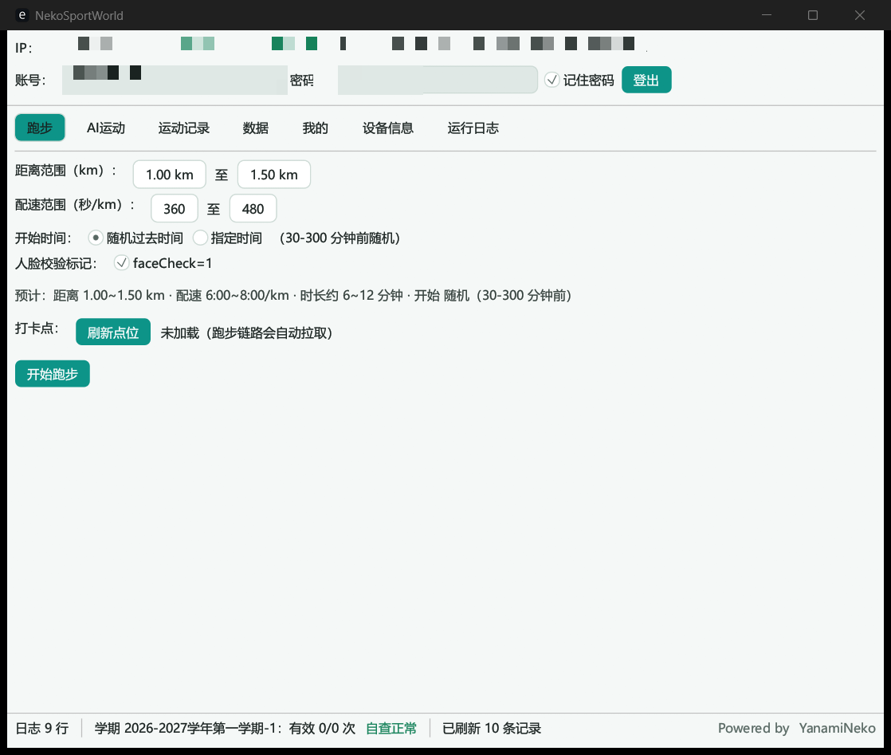

<h1 style="font-size: 48px;">别倒卖了😭</h1>

# NekoSportsWorldTool


运动世界校园版全协议自动化工具，纯 Rust 单文件，GUI / CLI 双模式。

> ⚠️ 仅供学习研究，请勿用于违反学校规定的场景，后果自负。

## 功能

- **跑步**：一键全链（策略 → 打卡点 → 轨迹 → 提交 → OBS → 验证），轨迹按打卡点自然生成，开始时间支持随机或指定到前 3 天
- **AI 运动**：任务 / 自由练习双模式，批量补签（前 60 天 × 多项目）
- **数据**：学期完成度、违规自查、排行榜（个人/班级/院系 × 日/月、室内榜、历史榜）、个人主页
- **登录**：支持人机验证自动通过
- **自动更新**：桌面端检查/下载/自替换并重启（GitHub Release 直连，无镜像）；Android 下载 APK 调起系统安装器；启动检查模式可选（静默/询问/关闭）

## 界面



## 技术特点

- 完整实现 NetSecKit 信封加密与响应解密，每个响应强制 RSA 验签（fail-closed）
- 人机验证全程本地完成，不依赖任何外部服务
- 轨迹生成器：打卡点拟合环 + 自然速度曲线 + 哨兵点 / 断崖 / 点位吸附
- 设备身份持久化（DeviceId / 安装时间 / MAC），稳定不易触发风控
- GUI 与 CLI 共用同一套协议层，数据文件互通

## 使用

双击 exe 进入 GUI；CLI 用法：

```text
NekoSportsWorldTool login --user <手机号> --pass <密码> --remember
NekoSportsWorldTool run                                  # 一键跑步（--altitude 17.2 固定海拔，或 11.6-22.8 映射到区间）
NekoSportsWorldTool ai --sport 2 --score 26000           # AI 运动
NekoSportsWorldTool rank main --type 1 --sort 1          # 排行榜
NekoSportsWorldTool update [--check]           # 自动更新（--check 仅检查不下载）
NekoSportsWorldTool template --file run.gpx   # 本地分析真实记录海拔（不会上传）
NekoSportsWorldTool help                                 # 全部命令
```

`template` 只读取用户手动选择的本地 GPX/JSON 文件，输出采样点、海拔范围、累计上升和累计下降，
不会登录、访问服务器或把模板记录接入跑步上传流程。

跑步页的手动海拔范围使用两个输入框：分别填写最低海拔和最高海拔，中间的连接符由界面自动显示；两项都留空则使用自动海拔。生成的海拔曲线会映射到该范围内，提交的累计爬升按“最高海拔 − 最低海拔”计算。命令行 `--altitude` 仍支持单值或 `min-max` 形式。

青龙定时任务：首次手工 `login --remember` 一次，之后定时挂 `run` 即可。

## 常见问题

- **提示未登录 / 401**：先执行 `login --remember`（GUI 勾选记住密码等价），会话失效会自动重登
- **10121 设备风险**：设备身份是持久化的，删除 `identity.json` 等于换了新设备，不要频繁删
- **10603 点位限流**：点位接口 5 分钟限 3 次，程序内置 300s 缓存，正常使用不会触发
- **榜单为空**：当天还没有人产生有效里程，查询会自动回退最近 3 天
- **检查更新失败**：更新仅直连 GitHub，网络不通时到 [Release](https://github.com/YanamiNeko/NekoSportsWorldTool/releases) 手动下载
- **人机验证失败**：自动重试 3 轮，仍失败大概率是网络波动，稍后再试
- **杀软误报**：未签名编译产物可能被误报，自行判断后加白

## 构建

```bash
cargo build --release                        # GUI + CLI
cargo build --release --no-default-features  # 仅 CLI
```

推 tag 自动构建 Windows / macOS / Linux 四平台产物并发布 Release（见 `.github/workflows/release.yml`）。

## 许可证

[CC BY-NC 4.0](LICENSE) © YanamiNeko（禁止商用）
